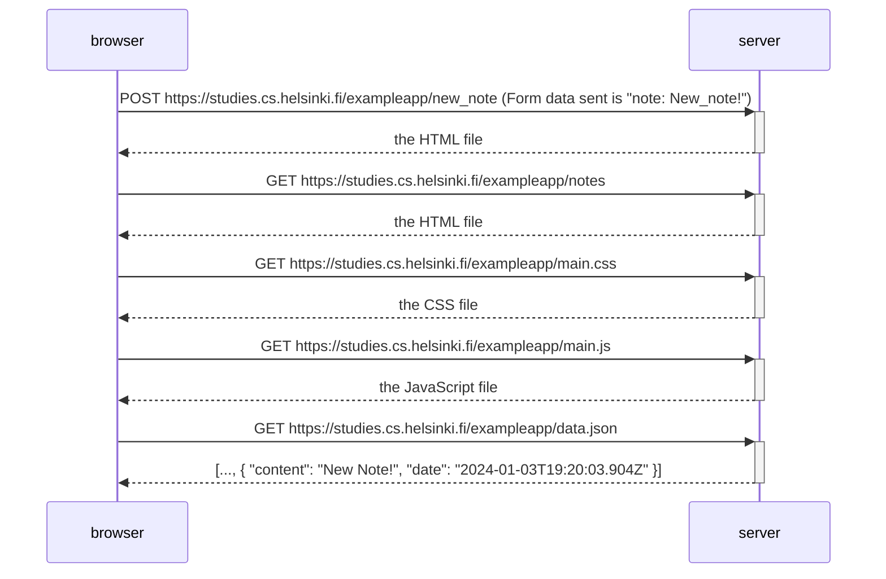

The following diagram shows the requests between the browser and the server when creating a new note with text: "New note!" in the following page: https://studies.cs.helsinki.fi/exampleapp/notes

The diagram doesn't show the initial GET requests when the page is loaded.

A screenshot of the requests is shown in the image.

What is intereting here is that the html seems to be transfered twice from the server, as a response to the POST request and as a response to the subsequent GET.