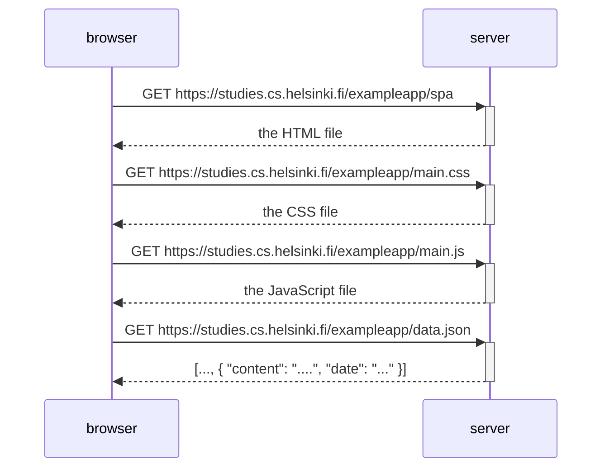

The following diagram shows the requests between the browser and the server when a user visits https://studies.cs.helsinki.fi/exampleapp/spa

### Chrome & Firefox

Both browser have the same behaviour.

